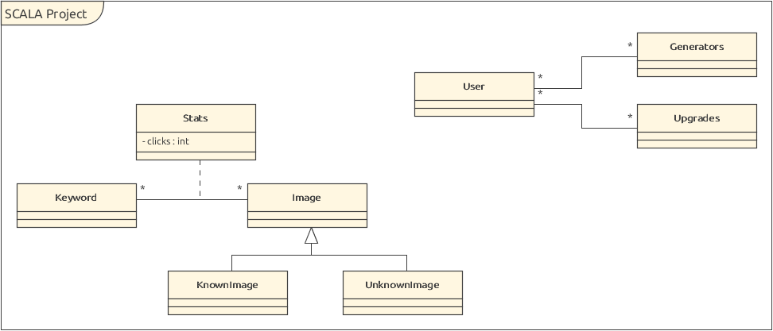

# HEIG-VD SCALA Project: Clicker

Guillaume Milani, Edward Ransome, Michaël Spierer

## Description
This project is part of the SCALA course at HEIG-VD, Yverdon-les-Bains. It consists of a Clicker game, i.e. a game whose goal is to earn as many points as possible mainly by clicking. In order to satisfy the latter, the player has several choices: click in a certain area to gain points, buy point generators with the user's current points which create more every second or buy bonuses to improve the two previous choices. The fourth way is to perform an image classification problem to earn a large point bonus. This will allow an administrator to use the game to collect information about an image set.

An administrator will have to provide two image sets: a classified image set, with corresponding keywords for each image, and the unclassified set they wish to collect data about. In order to reward users for correctly classifying images, we use the known image set. This discourages users from randomly selecting keywords for the unclassified set, by rewarding them when we know they are correct.
## Database schema

